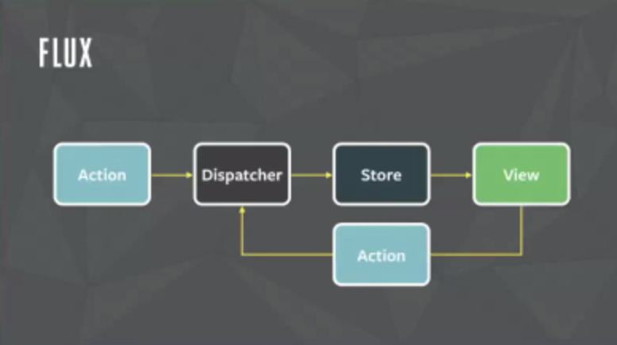

# * React Redux란?

## **Redux가 생겨난 이유**

자바스크립트 `싱글페이지 어플리케이션 (이하 'SPA')` 개발이 활발하게 이루어 지면서, 리엑트의 컴포넌트 상태를 나타내는 state의 구조가 점점 복잡해지고, JSON의 depth도 점점 깊어져 가면서, 상위 컴포넌트에서 state를 하위 컴포넌트로 계속 상태변화를 알려주기가 너무 복잡해 지는 상황이 발생하였고, 사이드 이팩트를 일으키는 비동기 통신 데이터는 복잡한 컴포넌트 구조에서 더욱 더 오류를 찾기도 힘들고 컴포넌트 테스트를 하기에도 힘들어졌기 때문에 상태관리를 편하게 하기위해 Redux가 생겨났다. `(MVC 패턴 -> Flux 패턴 , Redux)`

|MVC Pattern|Flux Pattern|
|:---:|:---:|
|||
---
## **Flux & Redux**

리덕스는 플럭스 패턴의 중요한 특징들에서 영감을 받아서 만들어졌다고, [리덕스 공식 문서]('https://lunit.gitbook.io/redux-in-korean/introduction/priorart')에도 나와있다.

1. Redux 는 Flux 패턴과 모델 업데이트 로직에 집중하게 해준다는 점은 동일하다.

2. Redux는 데이터의 상태를 바꾸지 않는다. (리듀서에서 상태를 변경하지 않는 것을 강력히 권장한다.)

3. Flux와 달리 Redux에는 디스패처라는 개념이 존재하지 않는다.

4. Flux와 달리 Redux는 스토어를 단 한개 이다.
---

## **Redux 규칙**

1. 어플리케이션의 상태를 나타내는 단 하나의 Store가 JSON형태로 구성된다.

2. Store 내부 state인 JSON은 무조건 action을 통해서만 변경한다.\
Flux 패턴의 핵심 개념과 동일하다.

3. Reducer 는 순수함수(Pure function) 으로 구성한다.\
리듀서는 엑션 타입과, 변경 전 State를 받아서 새로운 State를 리턴하는 함수로, 동일한 액션과 State를 받으면 동일한 값을 리턴한다.\
이 특징은 애플리케이션 디버깅을 쉽게 해준다.

---

## **Redux를 사용하기 좋은 예시**

1. 애플리케이션 전역에 공통으로 사용되는 컴포넌트가 공통의 상태관리를 공유할 경우\
`(모달 팝업 또는 페이지 로딩바)`

2. 상위 컴포넌트에서 무수히 많은 Depth의 하위 컴포넌트에 상태값을 내려줘야 되는경우\
\
